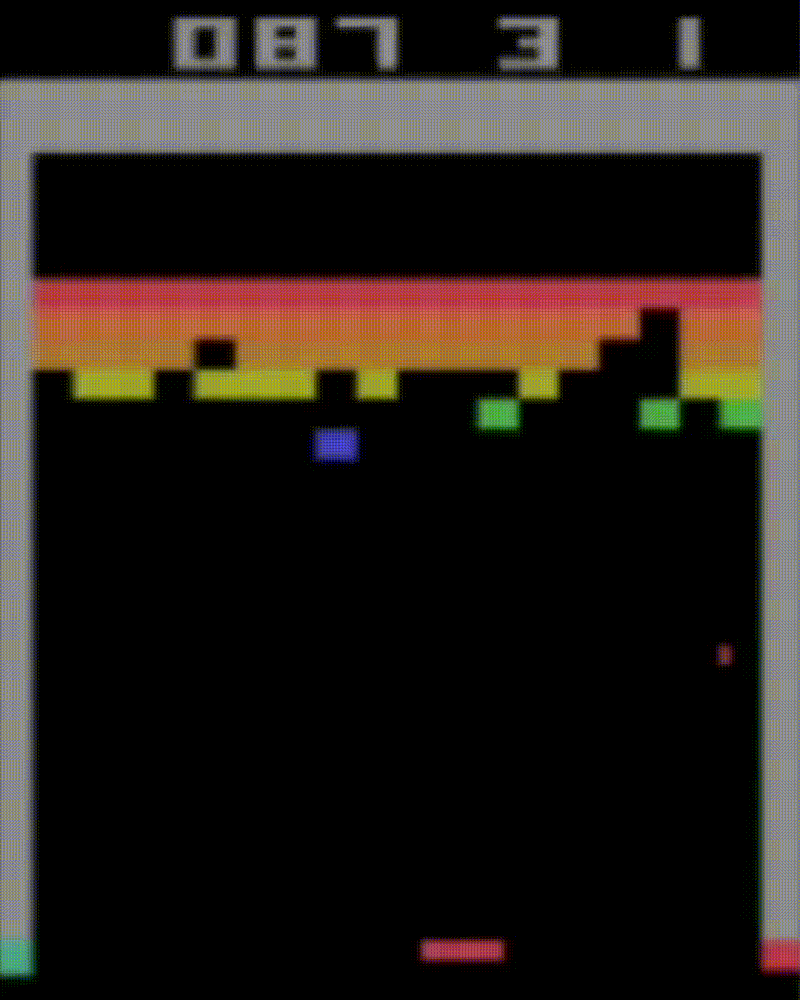
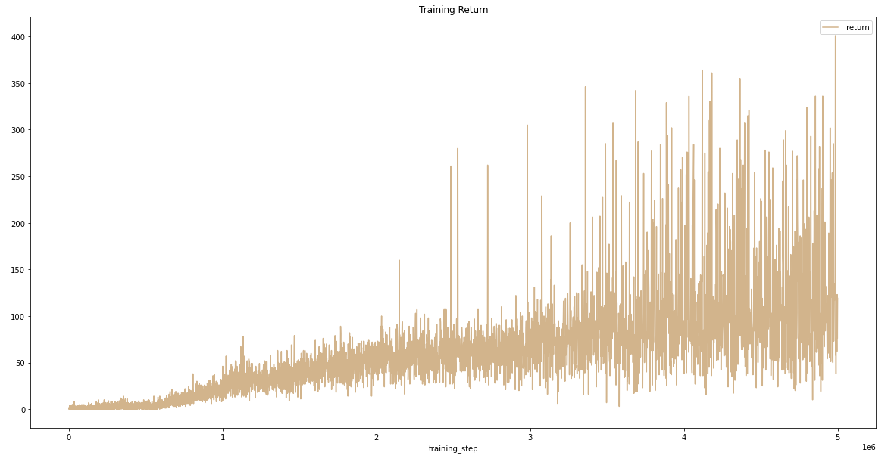
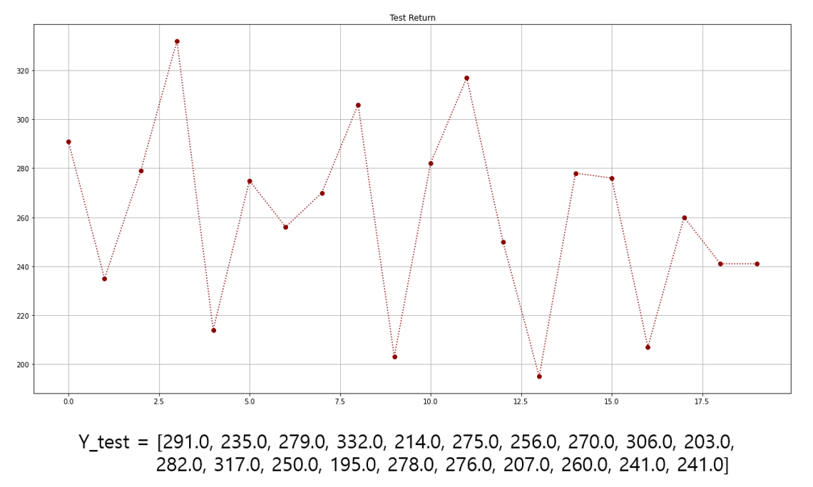

# Double-DQN
> Unofficial Implementation of **Double-DQN**
>  OpenAI-GYM : Atari-game environment **"breakout-v0"**
# Results
 
## Training & Test
~~~
learning rate : 0.001
gamma : 0.97
Total steps : 5000000 (maybe can be improved with more steps)
epsilon(in epsilon-greedy) : start with 1 ~ end with 0.1  
~~~
 
~~~
Render with matplotlib, pyvirtualdisplay in colab environment
Instable yet. Improve with more training steps!
~~~
 
# Requirements
~~~
pip install torch python-opencv numpy matplotlib
~~~
~~~
!pip install gym[all]==0.17.* pyvirtualdisplay==0.2.* PyOpenGL==3.1.* PyOpenGL-accelerate==3.1.*
~~~
~~~
!apt-get install -y xvfb x11-utils
~~~
### Getting ROMS
~~~
! wget http://www.atarimania.com/roms/Roms.rar && unrar x Roms.rar
~~~
~~~
! unzip ./ROMS.zip
~~~
~~~
! pip3 install gym-retro
~~~
~~~
! python -m atari_py.import_roms ./drive/MyDrive/DDQN/ROMS/
~~~
